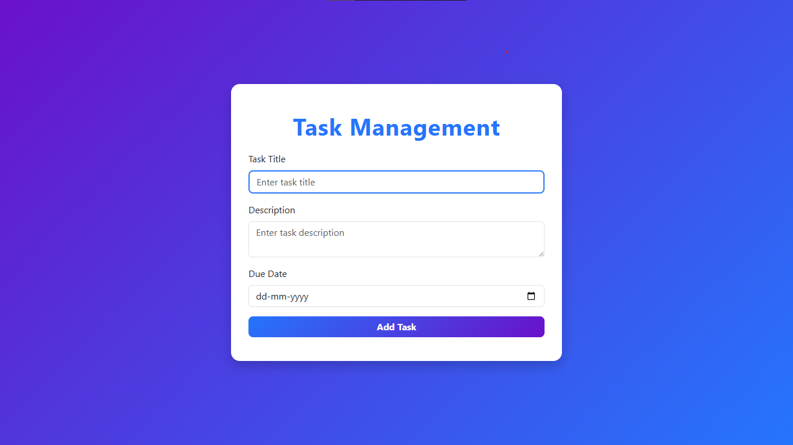

# 📝 Task Management App

A simple and stylish **Task Management Application** built using **HTML,
CSS, and JavaScript**.\
This app helps you create, edit, and delete tasks with due dates ---
perfect for managing daily goals.

------------------------------------------------------------------------

## 📸 Output Preview



> *(Replace `output.png` with the actual screenshot of your project.
> Place the image in the same folder as this README file.)*

------------------------------------------------------------------------

## 🌐 Live Demo
👉 [Click here to view the live project](https://your-username.github.io/task-management-app/)

------------------------------------------------------------------------

## 🚀 Features

-   ✅ Add new tasks with **title, description, and due date**\
-   ✏️ Edit tasks if needed\
-   ❌ Delete tasks when completed\
-   🎨 Beautiful **gradient UI design**\
-   📱 Fully responsive with **Bootstrap 5**

------------------------------------------------------------------------

## 📂 Project Structure

    Task-Management-App/
    │── index.html      # Main HTML file
    │── style.css       # Custom styling
    │── script.js       # App logic (add/edit/delete tasks)
    │── output.png      # Screenshot of the app
    │── README.md       # Project documentation

------------------------------------------------------------------------

## ⚡ Getting Started

1.  Clone this repository or download the project files.

    ``` bash
    git clone https://github.com/your-username/task-management-app.git
    ```

2.  Open `index.html` in your browser.

That's it 🎉 Your Task Manager is ready!

------------------------------------------------------------------------

## 🛠️ Technologies Used

-   **HTML5**
-   **CSS3 (Custom + Bootstrap 5)**
-   **JavaScript (Vanilla)**

------------------------------------------------------------------------

## 💡 Future Enhancements

-   Add **task completion toggle** (mark as done)\
-   Store tasks in **localStorage** so they persist after refresh\

------------------------------------------------------------------------

## 👨‍💻 Author

Developed by **\[Krishna Parmar\]** ✨\
Feel free to contribute, suggest features, or fork the repo!